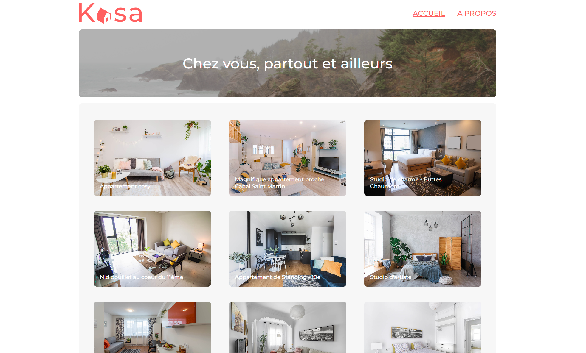

# PROJECT 7 bis - Kasa

This repository contains the new version project 7 of OpenClassrooms training.

For this project I have to do the integration of a figma maquette with REACT.

**Has always I like my code to be as clean as possible for scalability and maintenance and performance**

## HOW TO USE :

You can access the code by clone / download the zip.
`npm install` > `npm start`

You can also follow [this link](https://kasa-o6yeg3gdw-bol2rizh.vercel.app/) to get an overview